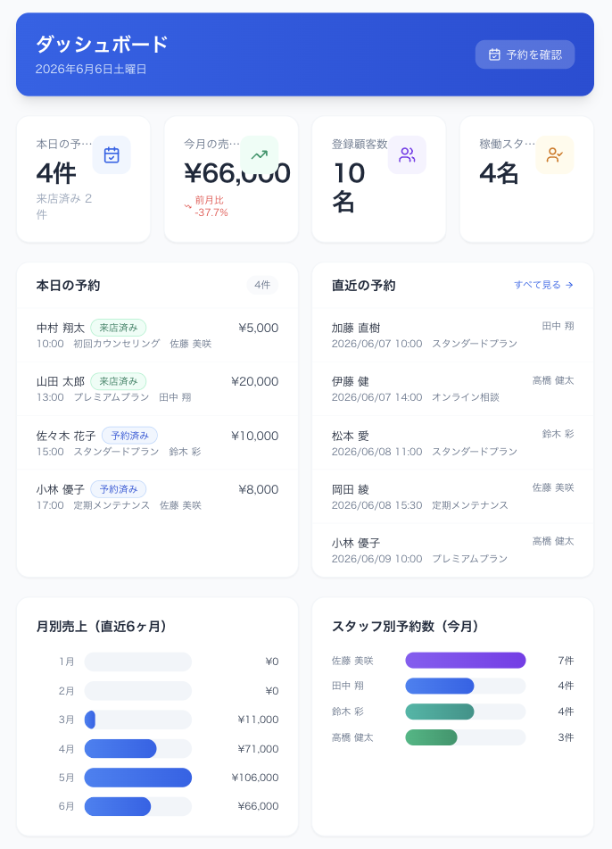
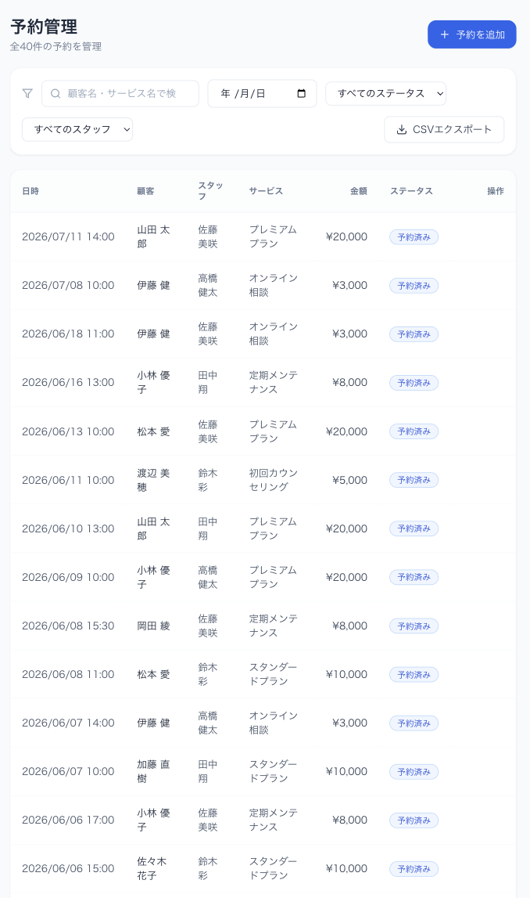
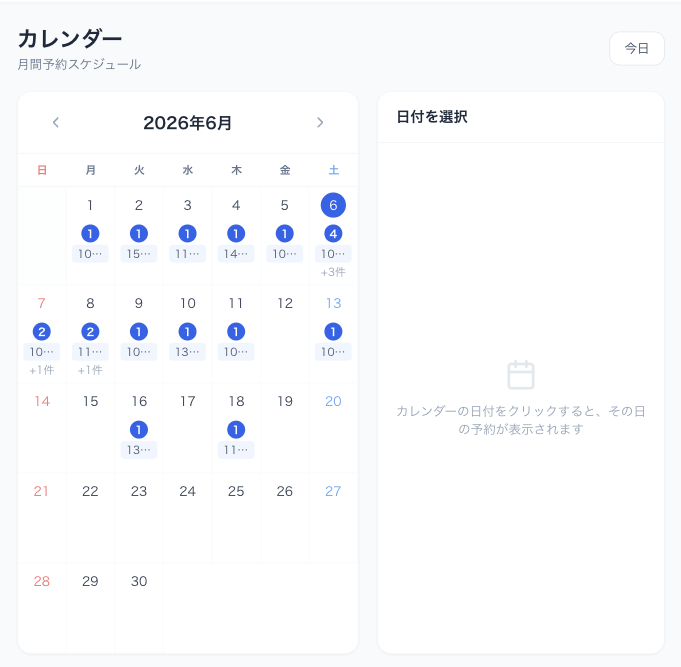
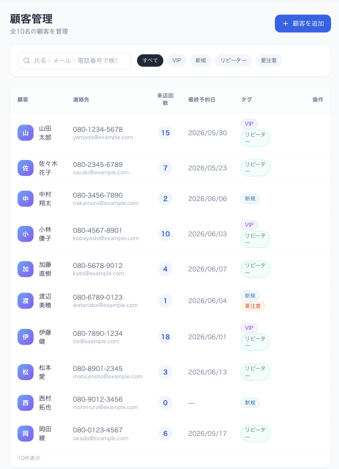
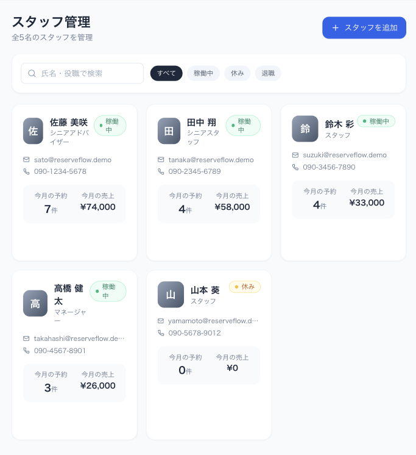
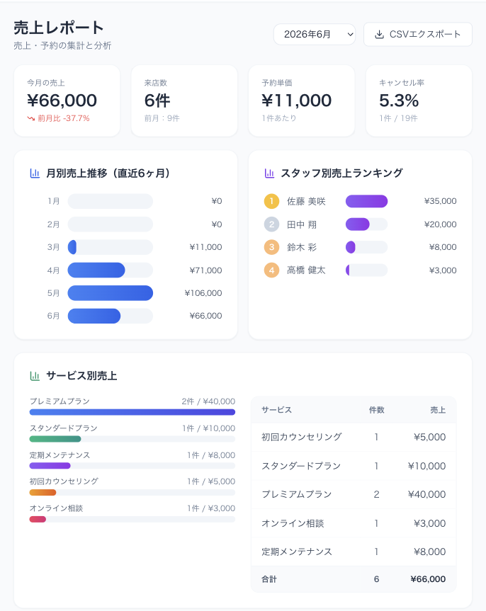

# ReserveFlow — 予約・顧客・スタッフ管理システム

> サロン・クリニック・スクール・小規模店舗で使える予約管理 Web アプリです ✨

[](https://nextjs.org)
[](https://www.typescriptlang.org)
[](https://tailwindcss.com)
[](https://vercel.com)

---

## 🔗 リンク

| | URL |
|---|---|
| 🌐 デモ（Vercel） | https://your-vercel-url.vercel.app |
| 📦 GitHub | https://github.com/ssk-t0/reserve-flow |

> **デモアカウント**
>
> | 権限 | メールアドレス | パスワード |
> |---|---|---|
> | 👑 管理者 | `admin@example.com` | `password` |
> | 🧑‍💼 スタッフ | `staff@example.com` | `password` |
>
> ログイン画面のボタンをクリックすると自動入力されます。初回アクセス時にサンプルデータが自動投入されます。

---

## スクリーンショット

| ダッシュボード | 予約管理 | カレンダー |
|---|---|---|
|  |  |  |

| 顧客管理 | スタッフ管理 | 売上レポート |
|---|---|---|
|  |  |  |

---

## このアプリについて

**ReserveFlow** は、サロンやスクールなどの小規模店舗で使える予約・顧客・スタッフ管理システムです。

データベースや外部サービスは使っていないので、ブラウザだけですぐ動かして試せます🙌  
「業務システムってこういう感じで作るんだ」というのが伝わるように、実際の現場を意識しながら設計しました。

---

## 作った理由

子育てのすき間時間で独学でプログラミングを勉強してきました。  
「実際に使えそうなものを作りたい！」という気持ちで、お店の予約管理をテーマに選びました。

検索・絞り込み・CSV出力・権限管理など、実務でよく使われる機能を一通り実装することで、  
「ちゃんと動くものが作れる」ことをお伝えできたらと思っています。

---

## 使用技術

| カテゴリ | 技術 |
|---|---|
| フレームワーク | Next.js 15（App Router） |
| 言語 | TypeScript 5 |
| スタイリング | Tailwind CSS 3 |
| アイコン | Lucide React |
| データ保存 | localStorage |
| デプロイ | Vercel |

外部のDB・認証サービスは使っていません。`package.json` と `package-lock.json` があれば `npm install` で環境を再現できます。

---

## できること

### 📊 ダッシュボード
- 今日の予約数・今月の売上・顧客数・スタッフ数をひと目で確認
- 本日の予約一覧と直近の予約を表示
- 月別売上グラフ・スタッフ別予約数グラフ（CSSで自作）

### 📅 予約管理
- 予約の追加・編集・削除（モーダルで操作）
- ステータス管理：予約済み / 来店済み / キャンセル / 無断キャンセル
- 名前・日付・ステータス・担当スタッフで絞り込み
- CSVエクスポート

### 🗓 カレンダー
- 月間カレンダーで予約を一覧表示（ライブラリ不使用で自作）
- 日付をクリックするとその日の予約詳細が見られます

### 👥 顧客管理
- 顧客の登録・編集・削除
- VIP・新規・リピーター・要注意のタグ管理
- 顧客詳細で予約履歴とメモを確認

### 🧑‍💼 スタッフ管理（管理者のみ）
- スタッフの登録・編集・削除
- 今月の予約数・売上をカード形式で表示

### 💰 売上レポート（管理者のみ）
- 月別売上・平均単価・キャンセル率を集計
- スタッフ別ランキング・サービス別内訳
- CSVエクスポート

### ⚙️ 設定（管理者のみ）
- 店舗名・営業時間・定休日・予約単位などを設定
- localStorageに自動保存

---

## 画面一覧

| URL | ページ名 | 内容 |
|---|---|---|
| `/login` | ログイン | デモアカウント表示付き。クリックで自動入力 |
| `/` | ダッシュボード | KPI・本日の予約・売上グラフ |
| `/reservations` | 予約管理 | CRUD・絞り込み・CSVエクスポート |
| `/calendar` | カレンダー | 月間カレンダーで予約を可視化 |
| `/customers` | 顧客管理 | タグ・予約履歴・対応メモ |
| `/staff` | スタッフ管理 | 売上集計・カード表示（管理者のみ） |
| `/reports` | 売上レポート | 月別・スタッフ別・サービス別分析（管理者のみ） |
| `/settings` | 設定 | 店舗情報の設定（管理者のみ） |

---

## デモのおすすめ手順 🎬

1. 上のデモURLを開く（または `npm run dev` でローカル起動）
2. ログイン画面のデモアカウントボタンをクリック → 自動入力されます
3. ダッシュボードで売上やグラフを確認してみてください
4. 予約管理で「予約を追加」からモーダルを開いて予約を作成
5. カレンダーで日付をクリックすると右に予約詳細が出ます
6. 顧客管理でタグ絞り込みをして、顧客名から詳細を開いてみてください
7. 売上レポートで月を切り替えて集計変化を確認・CSVも試せます
8. スタッフ管理・設定は管理者アカウントでのみ見られます

---

## ローカルでの起動方法

> ※ Webデモ（Vercel）があるので、ローカル起動は開発者向けです

```bash
# リポジトリをクローン
git clone https://github.com/ssk-t0/reserve-flow.git
cd reserve-flow

# パッケージをインストール
npm install

# 開発サーバーを起動
npm run dev
```

ブラウザで `http://localhost:3000` を開くとサンプルデータが自動投入されます。  
（`localhost` はご自身のPC上でのみ動作します。他の方はデモURLをご利用ください）

### Vercel へのデプロイ

```bash
npm run build  # ビルドエラーがないか確認
```

Vercel にリポジトリを連携すると自動デプロイされます。環境変数の設定は不要です✨

---

## こだわったポイント

**デザイン面**
- SaaS風の清潔感あるデザインを意識しました
- ステータスはカラーバッジで色分け（予約済み=青 / 来店済み=緑 / キャンセル=グレー / 無断=赤）
- テーブルはホバーで操作ボタンが出るすっきりレイアウトに
- データがない時はイラスト付きのメッセージを表示

**コード面**
- `useCallback` / `useMemo` で不要な再レンダリングを抑制
- `typeof window` チェックでSSR時のlocalStorageエラーを回避
- `any` を使わず、TypeScriptの型を丁寧に書きました
- 管理者とスタッフでメニューを動的に出し分け
- CSVはBOM付きUTF-8で出力（Excelで文字化けしない対策）
- 初回アクセス時に `localStorage` へサンプルデータを自動投入

---

## 今後やってみたいこと

- [ ] Supabase でバックエンド連携（DB・認証）
- [ ] 顧客向けの予約受付フォームページ
- [ ] LINEやメールでリマインド送信
- [ ] Google カレンダーと同期
- [ ] ドラッグ&ドロップで予約時間を変更
- [ ] グラフを Recharts でインタラクティブに

---

## アピールポイントまとめ

| ポイント | 内容 |
|---|---|
| 実務を想定した設計 | 予約・顧客・スタッフ・売上をひとつのシステムで管理 |
| フロントエンドだけで完結 | DBなし・認証なしでもすぐデモ可能 |
| TypeScriptを丁寧に | `any` なし・Union型・`as const` を積極活用 |
| コンポーネント分割 | Modal / StatusBadge / StatCard など役割ごとに分離 |
| 実用的な機能 | CSV出力・検索・絞り込み・権限管理 |
| レスポンシブ対応 | スマホ・タブレット・PCすべて対応 |
| Vercelにそのままデプロイ可 | 設定不要ですぐ公開できます |

---

## ライセンス

MIT License

---

<div align="center">

独学で作りました。見ていただきありがとうございます 🌸

</div>
